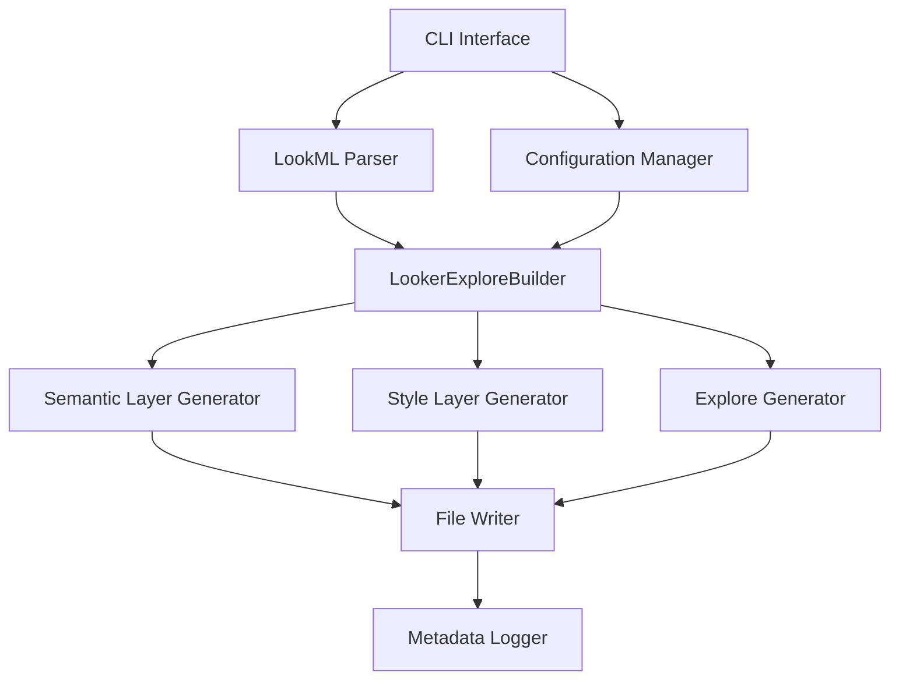

# Design Document

## Overview

The Looker Explore CLI is a Python-based command-line tool that automates the generation of LookML refinement layers from base views. Built as a forkable repository with a `looker` command structure, it transforms the existing notebook-based automation into a production-ready CLI tool that integrates seamlessly with IDE workflows.

The tool follows a deterministic, rule-based approach to ensure consistent output and maintains the existing three-layer architecture: semantic layer (business logic), style layer (UI formatting), and explore layer (relationships). It leverages the existing `LookerExploreBuilder` class while adding CLI interfaces, configuration management, and enhanced error handling.

## Architecture

### High-Level Architecture



### Component Layers

1. **CLI Layer**: Command parsing, argument validation, user interaction
2. **Configuration Layer**: Settings management, ontology loading, custom rules
3. **Core Logic Layer**: Existing `LookerExploreBuilder` with enhancements
4. **File Management Layer**: I/O operations, directory structure, metadata logging
5. **Validation Layer**: Input validation, error handling, dry-run capabilities

## Components and Interfaces

### CLI Interface Module (`cli.py`)

**Primary Interface**: Main entry point using Click framework for robust CLI functionality

```python
@click.group()
@click.version_option()
def looker():
    """Looker CLI tools for LookML automation"""
    pass

@looker.group()
def explore():
    """Explore generation and management commands"""
    pass

@explore.command()
@click.argument('view_name')
@click.argument('base_view_path')
@click.option('--ontology', '-o', help='Ontology configuration file')
@click.option('--output-dir', '-d', default='.', help='Output directory')
@click.option('--dry-run', is_flag=True, help='Preview changes without writing files')
def generate(view_name, base_view_path, ontology, output_dir, dry_run):
    """Generate LookML refinement layers from base view"""
```

**Interfaces**:
- Input: Command-line arguments, file paths, configuration options
- Output: Generated LookML files, progress messages, error reports

### Configuration Manager (`config.py`)

**Purpose**: Handle configuration files, ontology loading, and custom classification rules

```python
class ConfigManager:
    def load_ontology(self, ontology_path: str) -> Dict[str, Any]
    def load_classification_rules(self, rules_path: str) -> Dict[str, List[str]]
    def validate_config(self, config: Dict) -> bool
    def get_default_config(self) -> Dict[str, Any]
```

**Interfaces**:
- Input: Configuration file paths (YAML/JSON)
- Output: Validated configuration dictionaries

### Enhanced LookerExploreBuilder (`core.py`)

**Purpose**: Extended version of existing builder with CLI-specific enhancements

```python
class EnhancedLookerExploreBuilder(LookerExploreBuilder):
    def __init__(self, view_name: str, config: ConfigManager)
    def validate_base_view(self, base_view_path: str) -> ValidationResult
    def generate_with_progress(self, callback: Callable) -> Dict[str, str]
    def dry_run_preview(self) -> Dict[str, str]
```

**Interfaces**:
- Input: Base view files, configuration objects
- Output: Generated LookML content, validation results, progress updates

### File Manager (`file_manager.py`)

**Purpose**: Handle file I/O, directory management, and metadata logging

```python
class FileManager:
    def create_output_directory(self, path: str) -> Path
    def write_lookml_file(self, content: str, filepath: str, dry_run: bool = False)
    def backup_existing_files(self, filepaths: List[str])
    def log_generation_metadata(self, metadata: Dict) -> str
```

**Interfaces**:
- Input: File content, paths, metadata
- Output: Written files, backup files, metadata logs

### Validator (`validator.py`)

**Purpose**: Input validation, LookML syntax checking, configuration validation

```python
class LookMLValidator:
    def validate_syntax(self, lookml_content: str) -> ValidationResult
    def validate_base_view_structure(self, parsed_lookml: Dict) -> ValidationResult
    def validate_ontology_config(self, config: Dict) -> ValidationResult
```

**Interfaces**:
- Input: LookML content, configuration data
- Output: Validation results with detailed error messages

## Data Models

### Configuration Models

```python
@dataclass
class ClassificationRules:
    filters: List[str] = field(default_factory=list)
    measures: List[str] = field(default_factory=list)
    flags: List[str] = field(default_factory=list)
    ids: List[str] = field(default_factory=list)

@dataclass
class OntologyConfig:
    project: Dict[str, str]
    entities: Dict[str, Dict]
    relationships: List[Dict[str, str]]

@dataclass
class GenerationConfig:
    view_name: str
    base_view_path: str
    output_directory: str
    ontology_config: Optional[OntologyConfig]
    classification_rules: ClassificationRules
    dry_run: bool = False
```

### Result Models

```python
@dataclass
class ValidationResult:
    is_valid: bool
    errors: List[str] = field(default_factory=list)
    warnings: List[str] = field(default_factory=list)

@dataclass
class GenerationResult:
    success: bool
    generated_files: Dict[str, str]
    metadata_path: str
    errors: List[str] = field(default_factory=list)
    warnings: List[str] = field(default_factory=list)
```

## Data Models

### File Structure Models

```python
@dataclass
class LookMLFile:
    name: str
    path: str
    content: str
    layer_type: str  # 'source', 'semantic', 'style', 'explore'

@dataclass
class ProjectStructure:
    base_directory: Path
    views_directory: Path
    explores_directory: Path
    metadata_directory: Path
```

Now I need to complete the prework analysis before writing the Correctness Properties section:

<function_calls>
<invoke name="prework">
<parameter name="featureName">looker-explore-cli

## Correctness Properties

*A property is a characteristic or behavior that should hold true across all valid executions of a system-essentially, a formal statement about what the system should do. Properties serve as the bridge between human-readable specifications and machine-verifiable correctness guarantees.*

### Property Reflection

After analyzing all acceptance criteria, several properties can be consolidated to eliminate redundancy:

- Properties 1.1 and 4.3 both test parsing consistency and can be combined into a comprehensive parsing property
- Properties 1.3, 1.4, and 3.4 all test LookML generation and can be unified into a generation validity property  
- Properties 3.1, 3.2, and 3.5 all relate to file organization and can be combined
- Properties 6.1 and 6.3 both test error message quality and can be consolidated

### Core Properties

**Property 1: LookML Parsing and Classification Consistency**
*For any* valid LookML base view file, parsing and classifying dimensions should produce consistent categorization by data type and semantic meaning across multiple runs
**Validates: Requirements 1.1, 1.2, 4.3**

**Property 2: Generated LookML Syntax Validity**
*For any* set of classified dimensions and configuration, all generated LookML files (semantic, style, explore) should be syntactically valid and parseable by the LookML parser
**Validates: Requirements 1.3, 1.4, 1.5**

**Property 3: Deterministic Output Generation**
*For any* identical input parameters (base view, configuration, ontology), the CLI should produce identical output files across multiple executions
**Validates: Requirements 4.1**

**Property 4: File Organization and Naming Consistency**
*For any* view name and output configuration, generated files should follow consistent naming patterns and directory structures without overwriting unrelated files
**Validates: Requirements 3.1, 3.2, 3.3, 3.5**

**Property 5: Configuration Override Behavior**
*For any* custom classification lists (filters, measures, flags, IDs), the CLI should apply these overrides consistently and they should take precedence over automatic detection
**Validates: Requirements 5.1, 5.4**

**Property 6: Error Handling and Validation**
*For any* invalid input (malformed LookML, missing files, invalid ontology), the CLI should provide specific, actionable error messages without corrupting existing files
**Validates: Requirements 6.1, 6.2, 6.3, 6.4**

**Property 7: Batch Processing Resilience**
*For any* collection of input files, batch processing should handle individual file errors gracefully while continuing to process remaining valid files
**Validates: Requirements 7.1, 7.3**

**Property 8: Dry-run Consistency**
*For any* input configuration, dry-run mode should show exactly what would be generated without actually writing any files to disk
**Validates: Requirements 6.5**

**Property 9: Measure Formatting Rules**
*For any* numeric field with currency, percentage, or count indicators in the name, generated measures should apply appropriate formatting rules consistently
**Validates: Requirements 5.3**

**Property 10: CLI Interface Behavior**
*For any* valid command-line arguments and flags, the CLI should respond appropriately with expected outputs or help information
**Validates: Requirements 2.4**

## Error Handling

### Input Validation Errors
- **Invalid LookML Syntax**: Parse errors with line numbers and specific syntax issues
- **Missing Required Files**: Clear indication of expected file locations
- **Invalid Configuration**: Detailed validation errors for ontology and classification rules

### Runtime Errors
- **File System Errors**: Permission issues, disk space, path resolution
- **Processing Errors**: Dimension classification failures, generation errors
- **Batch Processing Errors**: Individual file failures with continuation logic

### Error Recovery Strategies
- **Partial File Cleanup**: Remove incomplete files on generation failure
- **Backup and Restore**: Backup existing files before overwriting
- **Graceful Degradation**: Continue processing when non-critical errors occur

### Error Message Standards
- Include specific error location (file, line number)
- Provide actionable suggestions for resolution
- Use consistent error codes for programmatic handling
- Log detailed error information for debugging

## Testing Strategy

### Dual Testing Approach

The testing strategy combines unit testing and property-based testing to ensure comprehensive coverage:

**Unit Tests**:
- Test specific examples and edge cases
- Validate CLI command parsing and help output
- Test error handling with known invalid inputs
- Verify file I/O operations and directory management

**Property-Based Tests**:
- Use Hypothesis library for Python property-based testing
- Configure each property test to run minimum 100 iterations
- Test universal properties across randomly generated inputs
- Validate correctness properties defined in this document

### Property-Based Testing Framework

**Library**: Hypothesis (Python property-based testing library)
**Configuration**: Minimum 100 iterations per property test
**Tagging**: Each property test tagged with format: `**Feature: looker-explore-cli, Property {number}: {property_text}**`

### Testing Categories

**Core Logic Testing**:
- LookML parsing with various dimension types and structures
- Classification rule application across different field patterns
- File generation with different configuration combinations

**CLI Interface Testing**:
- Command parsing with various argument combinations
- Help text generation and version information
- Error handling for invalid command usage

**Integration Testing**:
- End-to-end workflow from base view to generated files
- Configuration file loading and application
- Batch processing with mixed valid/invalid inputs

**Error Condition Testing**:
- Invalid LookML syntax handling
- Missing file scenarios
- Permission and file system errors
- Configuration validation failures